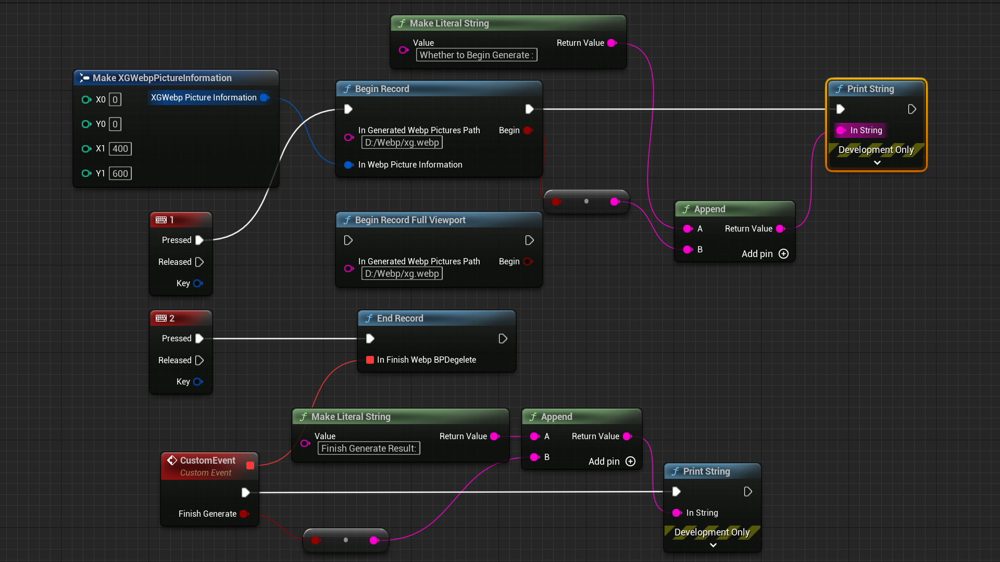
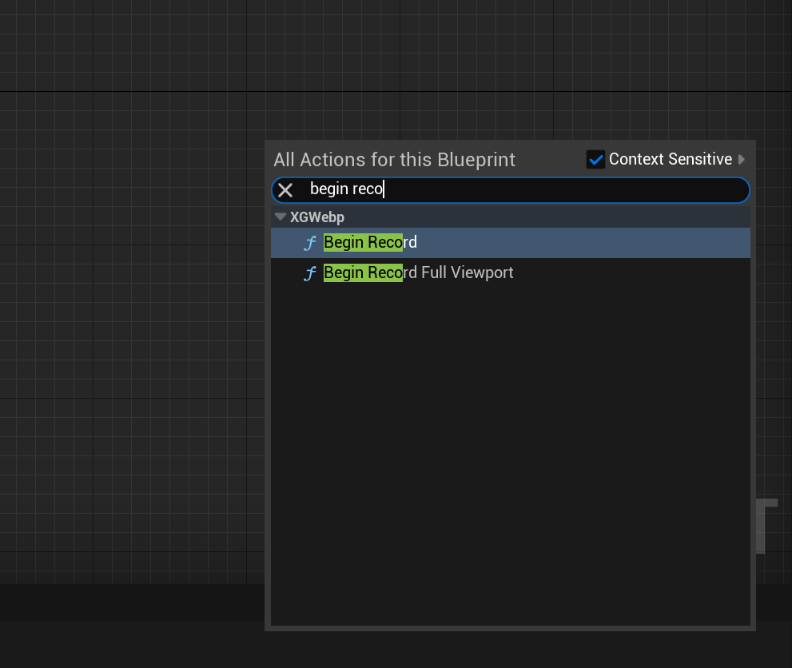
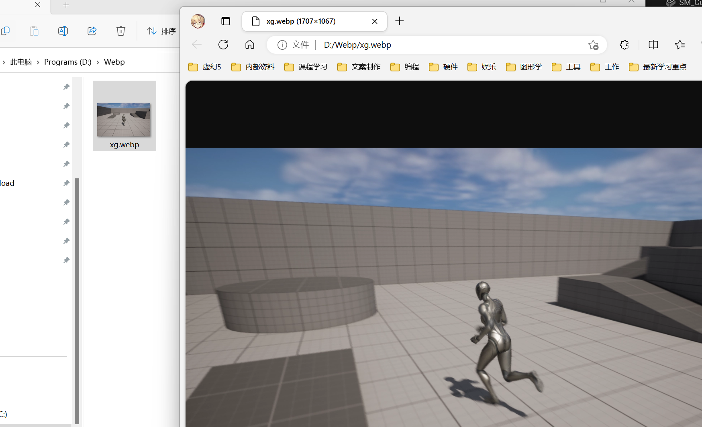

# XGWebp
Hello,everyone,This XGWebp Document. I will show you how to use this plugin to generate your own webp~

## BlurprintAPI
We hava three simple Blueprin API;

### 1.Establish your Folder
This Folder mush exist and can not be root directory.So this example I have a folder in disk D,"D:/Webp"
### 2.Begin to Record
you can use the beginrecord or beginrecord fullviewport.They are no more different,just webp size is different.

I strongly recommand you to use full viewport ,because  if you input wrong picture position ,you will not get right Beginning.
The extension must end with ".webp".
So ,the right path is "D:/Webp/xg.webp"

(X0,Y0)->(X1,Y1)If you want to get the pictrue size with 600x600,you can input (0,0) and (599,599)
If you want to get the center of viewport picture with 600x600,when Screen Size is 1920x1080,maybe
you can input (660,240) and(1259,839).

Becasue our viewport size is 1920x1080.but it starts with (0,0),end with (1919,1079).

The bool bBegin means whether to begin sucessfull. you must call beginrecord rightly before you call EndRecord.
### 3.Recording
After you executed beginning, we will  record every fram Color data,you don not do more work. It costs much ,so ,be careful how long time you will record.
### 4.EndRecording
XG_Webp_EndRecord 

just when you need ,end this Record. We will generate webp in right path .It is async. when finished ,we will call you with delegate.

### 5.Notes
Do not call begin record many times and end record many time .you should call one by one .
If you need finish many webp at the same time ,you can use c++Api
### 6.Package
There are no specail thing  to notify.
this plugins can work in both Editor and Runtime.
### 7.Version
In fact ,this plugins maybe can alse  be used 4.27,5.0,5.1,and so on.

## C++API
### 1.UXGWebpLibrary
provide C++ Api you can use .It is same with Blueprint ,just the callback is different.

### 2.FXGWebpCore
Plugin Core APi. you can use these api directly .

### 3.FXGWebpLibStruct
if you are not familiar with C++,You had better not use it directily .It is used to contact with libwebp. 
Many method wil be firset added to here ,Then to FXGWebpCore,Finally to UXGWebpLibrary And UXGWebpBPLibrary.

## Conclusion
Thanks for your support. now ,this is simple webp function ,more function will be added ~~
if any problem about this plugin,contact with me .
My Email:709777172@qq.com
discord:https://discord.gg/KQ3RMtrA

All under the Creative Commons Attribution 4.0 License, and code are licensed under the Apache 2.0 License

